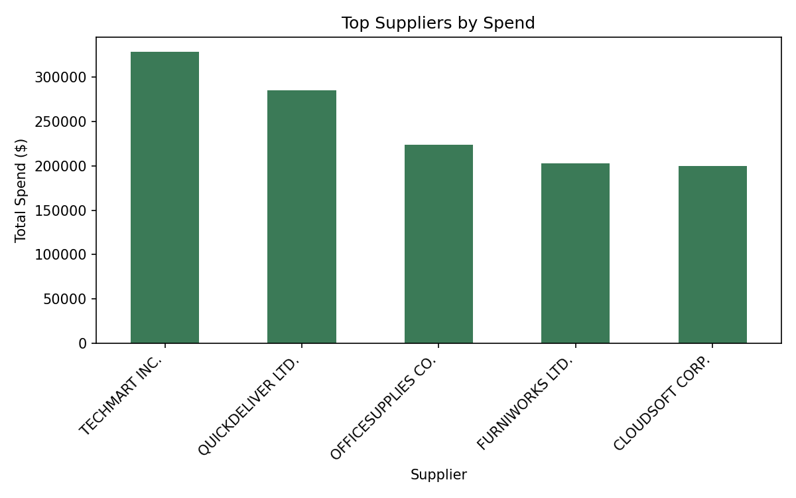
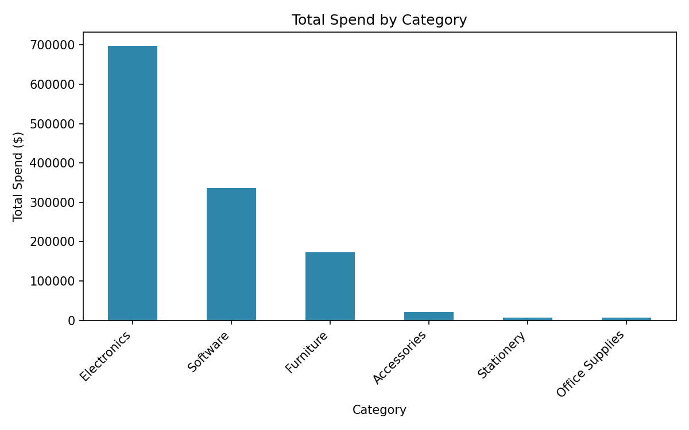
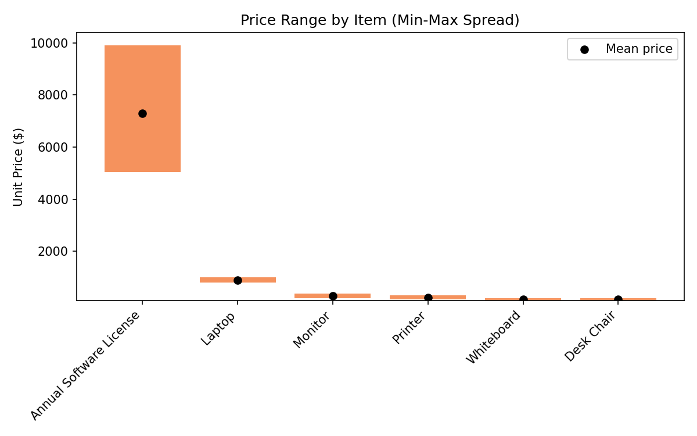

## Procurement Spend Analysis

## Business Problem
Procurement teams often lack visibility into where spend is concentrated, whether pricing is consistent across purchases, and which suppliers or categories carry the most risk. This project analyzes 500 procurement transactions to surface supplier concentration, category spend distribution, and price inconsistencies that could inform vendor consolidation and contract renegotiation decisions.

## Dataset
- 500 procurement transactions across 5 suppliers, 6 categories, and 12 months (Jan-Dec 2024)
- Fields: Transaction ID, Item Name, Category, Quantity, Unit Price, Total Cost, Purchase Date, Supplier, Buyer

## Approach
1. Loaded and validated the dataset (no missing values, consistent formatting after supplier name normalization)
2. Calculated total spend by supplier, category, and buyer
3. Measured price variance per item across suppliers to flag inconsistent pricing
4. Visualized findings with bar charts for supplier spend, category spend, and price range

## Key Findings

**1. Supplier concentration risk**
Top 3 suppliers (TechMart Inc., QuickDeliver Ltd., OfficeSupplies Co.) account for **67.5%** of total spend. TechMart Inc. alone represents 26.5% ($328,762) of all procurement spend, indicating heavy reliance on a small supplier base.

**2. Category spend is concentrated in Electronics and Software**
Electronics and Software together make up **83%** of total spend ($1.03M of $1.24M), while Furniture, Accessories, Stationery, and Office Supplies combined account for the remaining 17%.

**3. Significant price inconsistency on Annual Software Licenses**
The same license type was purchased for prices ranging from **$5,047 to $9,909**, a spread of nearly $5,000 across 46 transactions (std dev of $1,680). This is the single largest pricing inconsistency in the dataset and suggests a missing standardized contract or preferred vendor agreement for software licensing. Laptops and monitors also show moderate price variance worth reviewing.

## Business Impact
Standardizing the software licensing contract to the observed minimum price alone could save an estimated **$103,856 annually** across the 46 licenses purchased (actual spend of $336,018 vs. $232,162 if every purchase had been made at the lowest observed price). Consolidating spend from 5 suppliers to 2-3 preferred vendors could further improve negotiating leverage on volume discounts.

## Tools Used
Python, pandas, matplotlib, Jupyter Notebook

## Files
- https://github.com/AbdulUmar1005/Procurement-Spend-Analysis/blob/main/Procurement%20Spend%20Analysis.ipynb — full analysis notebook
- https://github.com/AbdulUmar1005/Procurement-Spend-Analysis/blob/main/spend_analysis_dataset.csv — source data
- https://github.com/AbdulUmar1005/Procurement-Spend-Analysis/blob/main/chart_price_variance.png
-  — supporting visuals

---
*Analyzed $1.24M in procurement spend across 500 transactions; identified 67.5% supplier concentration risk in top 3 vendors and $5K price variance on repeat software license purchases, surfacing consolidation and contract renegotiation opportunities.***
